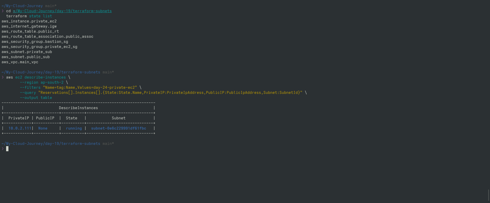

# Day 24 — Private EC2

## Goal

Deploy an EC2 instance inside the private subnet using Terraform.

## Network

VPC:
10.0.0.0/16

Public Subnet:
10.0.1.0/24

Private Subnet:
10.0.2.0/24

## Private EC2

Name:
day-24-private-ec2

Instance Type:
t3.micro

Subnet:
Private Subnet

Private IP:
Yes

Public IP:
No

## Security Group

SSH:
TCP 22

Source:
Bastion Security Group

SSH from:
0.0.0.0/0

NO

## Architecture

Internet
   |
   v
IGW
   |
Public Route Table
   |
Public Subnet
   |
Bastion EC2
   |
   | SSH
   v
Private Subnet
   |
Private EC2

## Important Concept

A private EC2 has a private IP but no public IPv4 address.

The private subnet currently has no route to the Internet Gateway.

Therefore direct Internet access is not available.

## Terraform Resources

aws_security_group.private_ec2_sg
aws_instance.private_ec2

## Verification Proof

