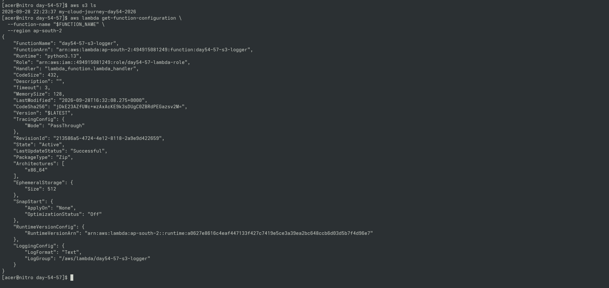
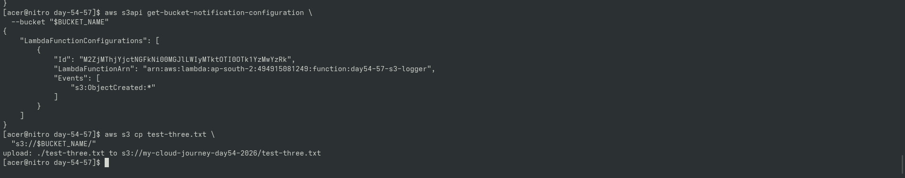

# Day 54–57 — S3 → Lambda Event-Driven Architecture

## Goal

Build and verify an event-driven S3 → Lambda integration.

## Architecture

S3
 ↓
ObjectCreated Event
 ↓
Lambda
 ↓
CloudWatch Logs

## Day 54

- Created dedicated S3 bucket
- Created Python Lambda function
- Created Lambda execution role
- Added CloudWatch logging permissions
- Tested Lambda configuration

## Day 55

- Added S3 → Lambda invocation permission
- Configured S3 ObjectCreated notification
- Uploaded test objects

## Day 56

Debugged IAM and integration issues.

Important permission relationships:

1. Lambda execution role
2. Lambda resource-based invocation policy
3. AWS CLI identity

### Execution Role

Controls what Lambda can do.

### Resource Policy

Controls who can invoke Lambda.

### Trust Policy

Controls who can assume the IAM role.

## Day 57

Tested multiple S3 uploads and verified Lambda execution through CloudWatch Logs.

## Important Concepts

Event-driven architecture:

S3 event
 ↓
Lambda

IAM:

Trust Policy
=
Who can assume the role?

Permission Policy
=
What can the role do?

Resource Policy
=
Who can invoke the Lambda?

## Main Lesson

S3 produces an event when an object is created.

Lambda reacts to the event.

IAM controls the permissions required by the Lambda and the invocation relationship.

## Evidence

- S3 bucket
- Lambda configuration
- S3 notification configuration
- Lambda invocation permission
- CloudWatch Logs
- Successful S3 upload

## Evidence & Verification

### 1. S3 Bucket & Lambda Function Configuration

### 2. S3 Notification Trigger & Live Upload Test

