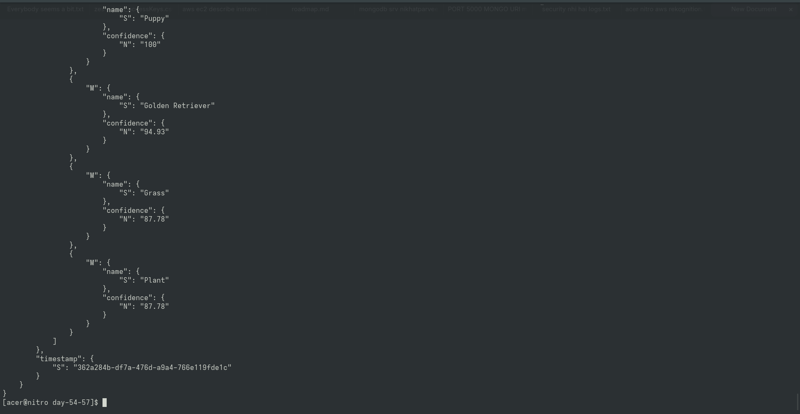

# Day 63 — Lambda to DynamoDB Integration

## Overview
Connected processing Lambda (`day54-57-s3-logger`) to write Rekognition label outputs into DynamoDB table `day54-57-image-results`.

## DynamoDB Item Verification

