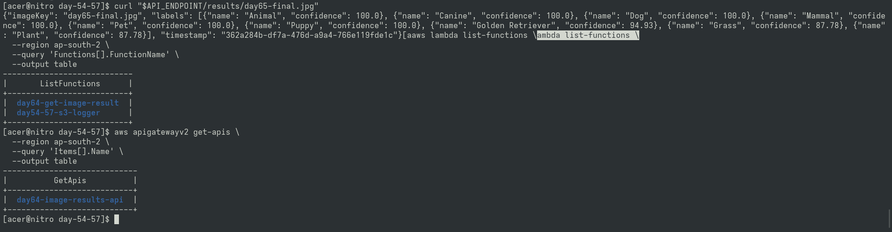

# Day 64 — API Gateway HTTP API Setup

## Overview
Exposed an HTTP REST API (`day64-image-results-api`) to retrieve DynamoDB image results via `GET /results/{imageId}`.

## Function Configuration & Architecture

