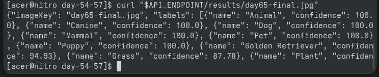
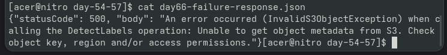
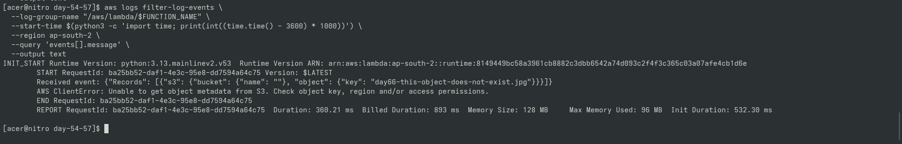

# Day 66 — Serverless Reliability & Controlled Failure Testing

## Overview
Initiated the **Reliability and Observability** phase for the Serverless AI Image Recognition Pipeline. Conducted controlled failure testing by passing a non-existent S3 object payload to evaluate system resilience and CloudWatch log behavior.

---

## 📸 Proof of Execution & Observability

### 1. Baseline Success (Day 65 API Verification)

### 2. Controlled Failure Output (`InvalidS3ObjectException`)

### 3. CloudWatch Error Stack Trace Diagnosis

---

## 🧠 Key Takeaways
1. **Dependency Isolation:** Rekognition exception stopped execution immediately, preventing unverified records from reaching DynamoDB.
2. **AWS CLI v1 Log Retrieval:** Used `aws logs describe-log-streams` + `aws logs get-log-events` to inspect logs without CLI v2 `aws logs tail`.
3. **Architectural Gap:** Unhandled exceptions require asynchronous retry/alert mechanisms (such as SQS Dead Letter Queues or SNS notifications) for production reliability.
