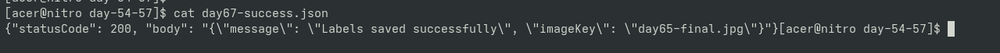
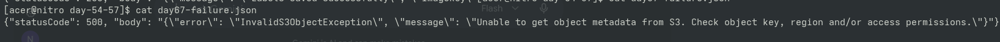

# Day 67 — Lambda Error Handling

## Goal

Improved failure handling in the serverless image
processing pipeline.

## Concepts

- try/except
- controlled errors
- structured responses
- application logging
- success path
- failure path

## Success Path

S3
 ↓
Lambda
 ↓
Rekognition
 ↓
DynamoDB

## Failure Path

S3
 ↓
Lambda
 ↓
Rekognition
 ↓
Exception
 ↓
Controlled error response
 ↓
CloudWatch Logs

## Practical Validation

Tested both a known-good image and an intentionally
invalid S3 object.

---

## 📸 Proof of Execution

