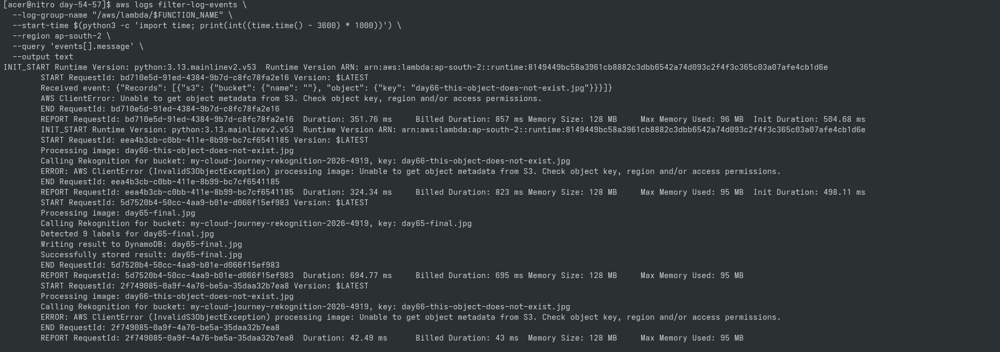
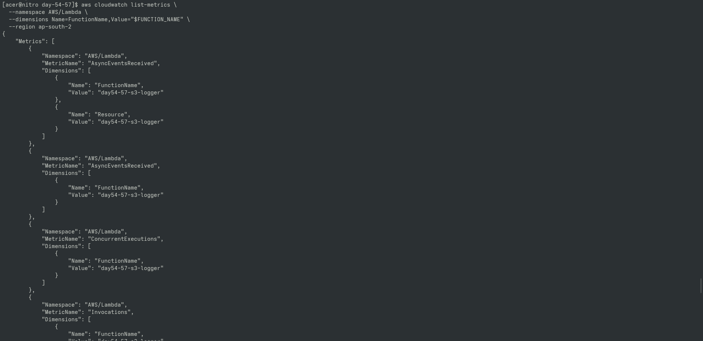
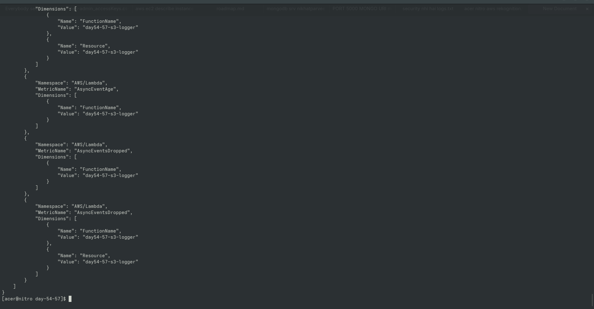

# Day 68 — Serverless Observability

## Concepts

- CloudWatch Logs
- Lambda metrics
- Invocations
- Errors
- Duration
- Throttles
- Structured application logging
- Failure investigation

## Observability Model

Logs:
"What happened?"

Metrics:
"How often/how much?"

## Practical Work

Inspected Lambda CloudWatch logs after both
successful and failed executions.

## Architecture

S3
 ↓
Lambda
 ↓
Rekognition
 ↓
DynamoDB

CloudWatch observes the Lambda execution path.

---

## 📸 Proof of Execution

