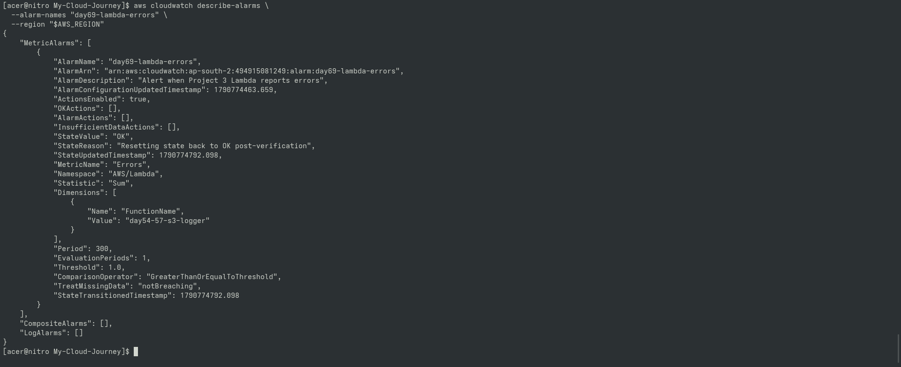
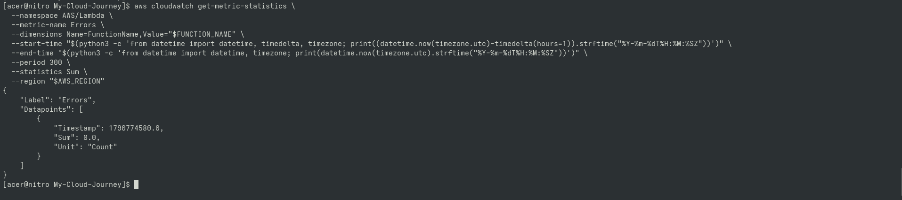
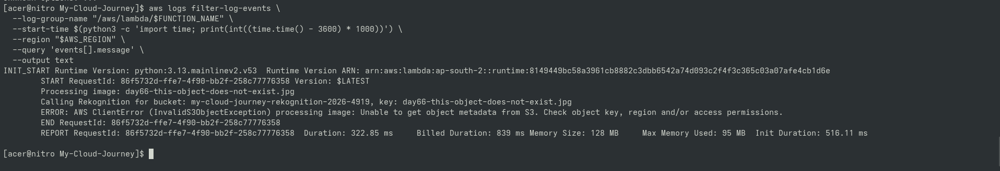

# Day 69 — CloudWatch Alarms for Lambda

## Goal

Added operational monitoring to the Project 3 Lambda
using Amazon CloudWatch alarms.

## Monitoring Flow

Lambda
 ↓
AWS/Lambda Errors metric
 ↓
CloudWatch Alarm
 ↓
Operational state

## Alarm

Name:
day69-lambda-errors

Metric:
AWS/Lambda → Errors

Threshold:
>= 1 error

Period:
5 minutes

Evaluation:
1 period

## Practical Test

A controlled Lambda failure was generated to verify
the monitoring path.

## Important Concepts

- CloudWatch metrics
- Lambda Errors metric
- CloudWatch alarms
- OK state
- ALARM state
- Missing data handling

---

## 📸 Proof of Execution

### Screenshot 1: CloudWatch Alarm Configuration

### Screenshot 2: Lambda Errors Metric Statistics

### Screenshot 3: CloudWatch Execution Logs

