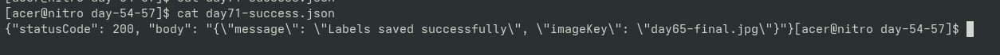
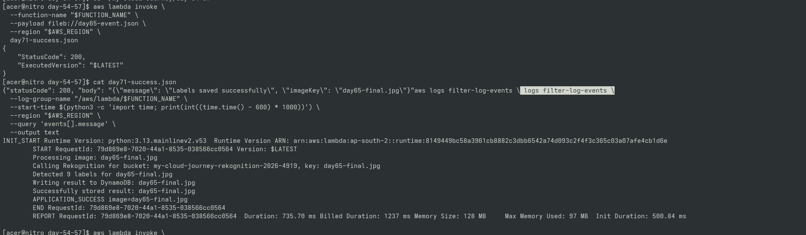
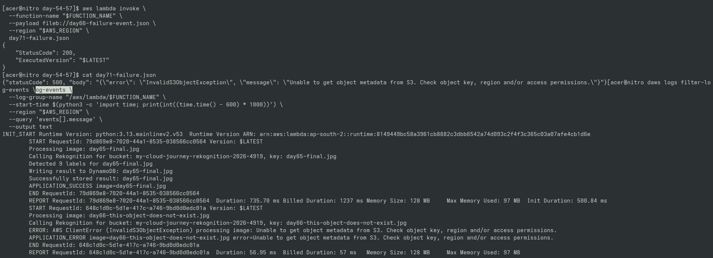

# Day 71 — Application-Level Reliability Signals

## Goal

Extended Lambda observability by distinguishing
successful application processing from handled application
failures.

## Important Concept

AWS Lambda's built-in Errors metric represents runtime
errors that cause the Lambda invocation to fail.

Handled application exceptions may return a 500 response
without incrementing the Lambda Errors metric.

## Application Signals

Success:

APPLICATION_SUCCESS

Failure:

APPLICATION_ERROR

## Practical Validation

Tested both:

1. Known-good image processing
2. Controlled invalid-image failure

CloudWatch Logs were inspected to verify both signals.

---

## 📸 Proof of Execution

### Screenshot 1: Successful Invocation Response (`day71-success.json`)

### Screenshot 2: CloudWatch Log Stream — `APPLICATION_SUCCESS` Marker

### Screenshot 3: CloudWatch Log Stream — Controlled Failure & `APPLICATION_ERROR` Marker

