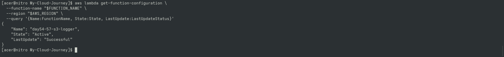
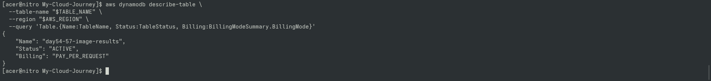
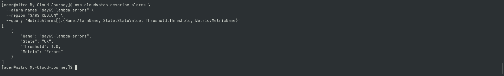
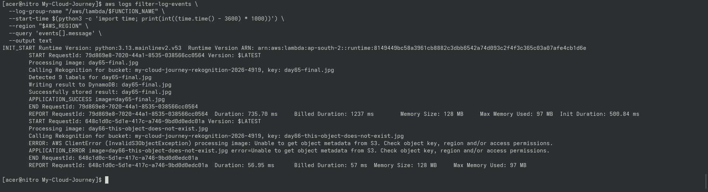

# Day 72 — Serverless Operational Monitoring

## Goal

Verified the operational monitoring architecture after
introducing application-level reliability signals.

## Monitoring Layers

### Layer 1 — Application Logs

APPLICATION_SUCCESS
APPLICATION_ERROR

### Layer 2 — Lambda Runtime Metrics

AWS/Lambda metrics such as:

- Invocations
- Errors
- Duration
- Throttles

### Layer 3 — CloudWatch Alarm

day69-lambda-errors

## Verification

- Lambda health verified
- DynamoDB health verified
- CloudWatch alarm verified
- Application success logs verified
- Application failure logs verified
- Existing Project 3 result verified

## Key Lesson

Runtime failures and handled application failures are
different operational signals and must be understood
separately.

---

## 📸 Proof of Execution

### Screenshot 1: Lambda Function Health Verification

### Screenshot 2: DynamoDB Table Health Verification

### Screenshot 3: CloudWatch Alarm Operational State

### Screenshot 4: Filtered Application Execution Logs

