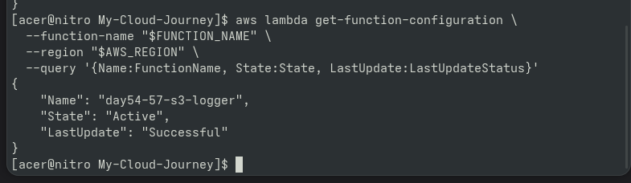
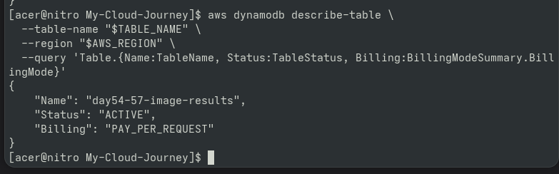
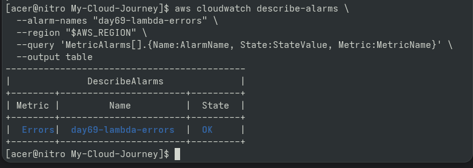
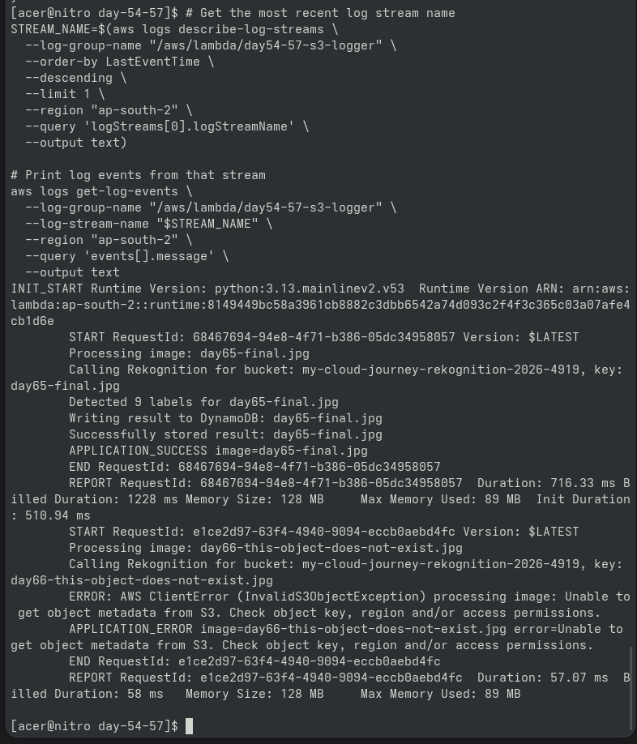

# Day 73 — Project 3 Demo

## Goal

Recorded a short demonstration of the complete
serverless AI image-processing pipeline.

## Demo Flow

S3 Upload
↓
Lambda
↓
Amazon Rekognition
↓
DynamoDB
↓
API Gateway
↓
Labeled Image Result

## Demonstration

A test image was uploaded to the Rekognition-compatible
S3 bucket.

Lambda processed the image and called Rekognition.

Detected labels were stored in DynamoDB.

The API Gateway endpoint was then used to retrieve
the labeled result.

## Evidence

The repository contains screenshots documenting:

1. S3 upload
2. Lambda processing
3. DynamoDB result
4. API response

A short demo video was also recorded for portfolio use.

---

## 📸 Proof of Execution

### 1. S3 / Lambda Health Verification

### 2. DynamoDB Table Result Verification

### 3. CloudWatch Alarm State

### 4. Application Execution Logs & Response Traces

