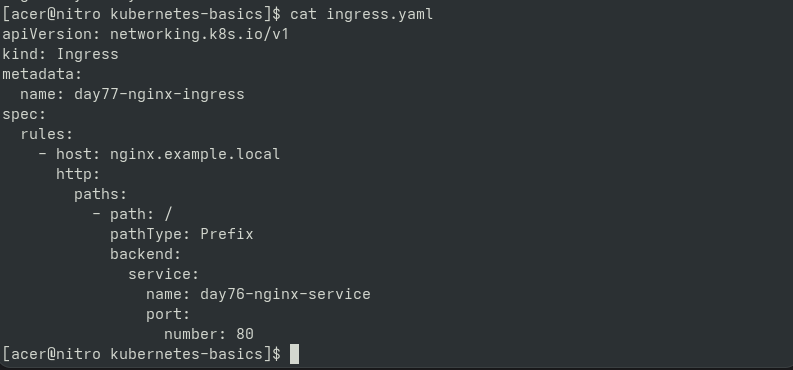
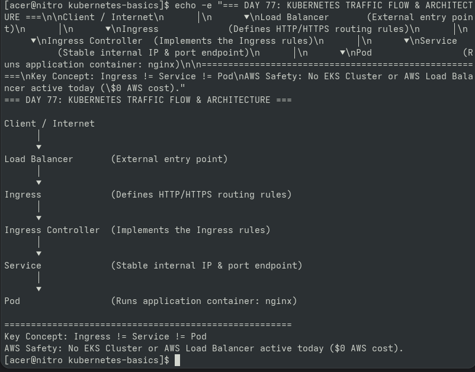
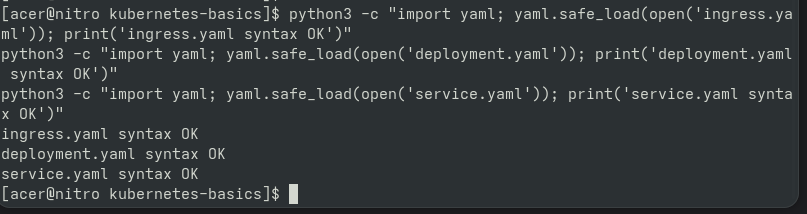

# Day 77 — Kubernetes Ingress & Traffic Flow

## Goal

Learn how external HTTP traffic can reach an application
running inside Kubernetes.

## Traffic Flow

Client
  ↓
Load Balancer
  ↓
Ingress
  ↓
Service
  ↓
Pod
  ↓
Container

## Key Concepts

### Pod
Runs the application workload.

### Service
Provides stable networking to Pods.

### Ingress
Defines HTTP/HTTPS routing rules.

### Ingress Controller
Implements the Ingress behavior.

### Load Balancer
Can provide external access to the cluster.

## Screenshots & Portfolio Proof

### 1. Ingress Manifest (`ingress.yaml`)

### 2. Traffic Flow Architecture

### 3. Syntax Validation

## AWS Safety

No EKS Load Balancer or EKS cluster was created
during this learning stage.
