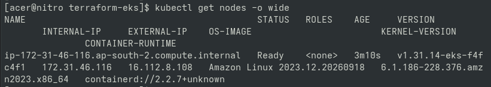
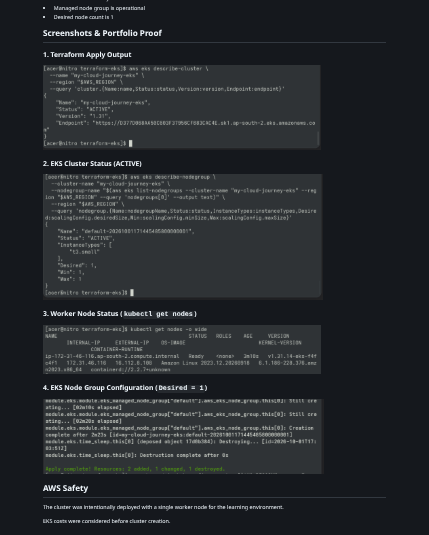
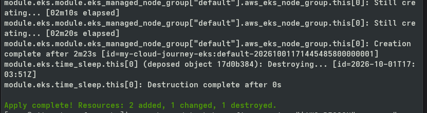

# Day 80 — EKS Cluster Creation

## Goal

Created the Project 4 Amazon EKS cluster using Terraform
and verified Kubernetes connectivity.

## Architecture

CachyOS
  ↓
kubectl
  ↓
Amazon EKS
  ↓
Managed Node Group
  ↓
Kubernetes Worker Node

## Verification

The following were verified:

- EKS cluster exists
- EKS cluster status is ACTIVE
- Kubernetes API is reachable
- kubectl context is configured
- Worker node is Ready
- Managed node group is operational
- Desired node count is 1

## Screenshots & Portfolio Proof

<<<<<<< HEAD
### 1. EKS Cluster Status (ACTIVE)

=======
### 1. EKS Node Group Configuration (`Desired = 1`)

### 2. Terraform Apply Output

>>>>>>> 2c42f5d (Align Day 80 README section headers with rendered screenshot filenames)

### 2. EKS Node Group Configuration (`Desired = 1`)

### 3. Worker Node Status (`kubectl get nodes`)

<<<<<<< HEAD
### 4. Terraform Apply Output

=======
### 4. EKS Cluster Status (ACTIVE)

>>>>>>> 2c42f5d (Align Day 80 README section headers with rendered screenshot filenames)
## AWS Safety

The cluster was intentionally deployed with a single
worker node for the learning environment.

EKS costs were considered before cluster creation.
