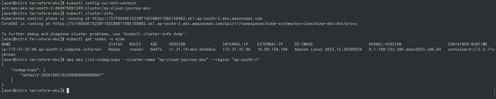

# Day 81 — EKS kubectl Connectivity

## Goal

Configured `kubectl` to communicate with the Amazon EKS cluster created on Day 80.

## Verification

- AWS region verified (`ap-south-2`)
- EKS cluster verified (`my-cloud-journey-eks`)
- `kubeconfig` updated successfully
- Active context pointed to EKS
- Control plane running and reachable
- Worker node verified in `Ready` state (`v1.31`)
- Managed node group listed

## Portfolio Proof

## Architecture

CachyOS → AWS CLI → EKS Control Plane → kubectl → Worker Node (t3.small)

## Safety

Single-node managed configuration preserved for cost control.
