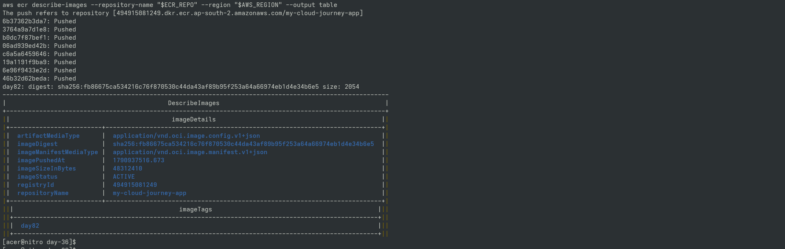

# Day 82 — Push Docker App to Amazon ECR

## Goal

Built and uploaded the Phase 3 Python Flask application image (Port 5000) to Amazon ECR.

## Details

- **App Location**: `day-36/`
- **Port**: `5000`
- **AWS Region**: `ap-south-2`
- **Repository**: `my-cloud-journey-app`
- **Tag**: `day82`

## Verification

- Local Docker build completed
- Application tested locally on port 5000
- Amazon ECR repository created
- Docker authenticated with ECR
- Docker image pushed to ECR
- Image tag (`day82`) verified in ECR

## Portfolio Proof

## Safety

Created only one ECR repository to save cost.
