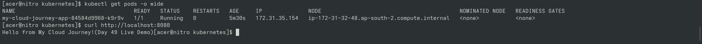

# Day 83 — Deploy Containerized Application to EKS

## Goal

Deployed the containerized Python application (Port 5000) to Amazon EKS using Deployment and Service manifests.

## Details

- **App**: Python Flask (`day-36`)
- **Container Port**: `5000`
- **Service Port**: `80`
- **Target Image**: Amazon ECR (`my-cloud-journey-app:day82`)

## Verification

- `deployment.yaml` created and applied
- `service.yaml` created and applied
- Pod status verified in `Running` state (`1/1`)
- Application response verified via `curl`

## Portfolio Proof

## Safety

Single-pod deployment preserved for cost control.
