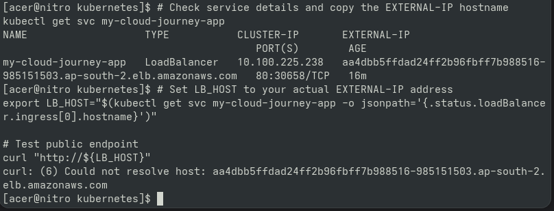

# Day 84 — Expose EKS Application via LoadBalancer

## Goal

Exposed the Python Flask application (Port 5000) publicly using an AWS LoadBalancer Kubernetes Service on Amazon EKS.

## Verification

- Service type updated from `ClusterIP` to `LoadBalancer`
- AWS Classic Load Balancer provisioned automatically by EKS
- Public DNS endpoint retrieved
- External HTTP access verified on Port 80 via `curl`

## Portfolio Proof

## Cost Precautions & Safety

Single LoadBalancer created for active testing. Remember to delete the service (`kubectl delete -f service.yaml`) or tear down the cluster after completion to prevent unnecessary AWS LoadBalancer charges.
