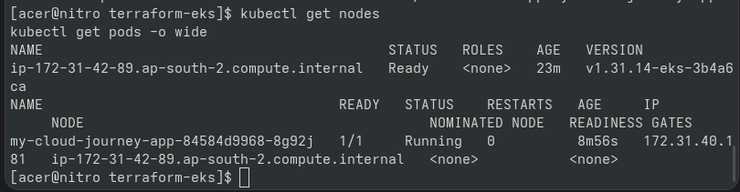
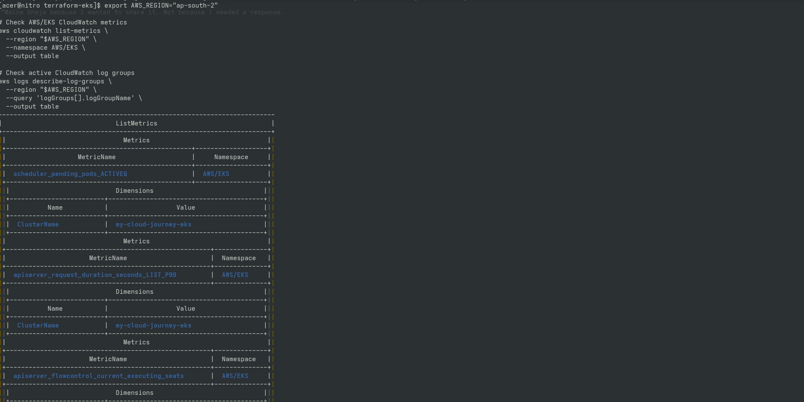
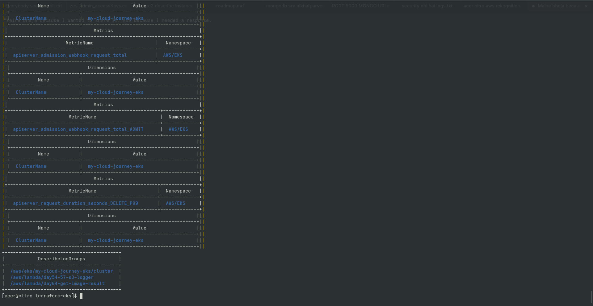
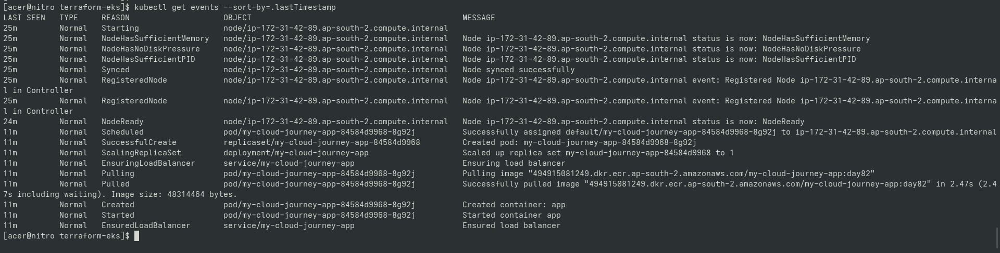
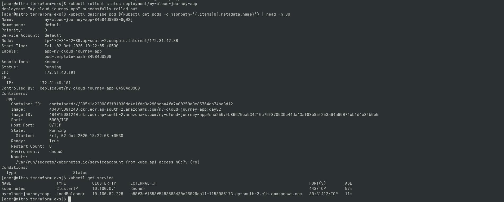

# Day 85 — EKS Upgrade Troubleshooting & Rebuild Strategy

## Goal

Diagnose EKS control plane upgrade failure (`1.31` → `1.32`), inspect EKS Insights API blockers, and evaluate cost-effective infrastructure recovery using Infrastructure as Code (IaC).

## Key Findings & Incident Analysis

1. **Upgrade Failure Root Cause:** The EKS control plane upgrade was blocked by pre-flight readiness checks triggered via EKS Insights API (outdated add-ons or deprecated API versions).
2. **Cost Surcharge Avoidance:** Extended support for older EKS versions incurs **$0.60/hr** instead of standard **$0.10/hr** (6x cost multiplier). 
3. **IaC Recovery:** Tearing down the cluster and redeploying via Terraform on a standard-support version is faster, cheaper, and demonstrates true IaC reproducibility.

---

## 📸 Proof of Execution & Diagnostics

### 1. EKS Cluster Status & Upgrade Failure Output

### 2. EKS Insights API Query

### 3. Detailed EKS Insight Diagnostic Output

### 4. Terraform Variables & Configuration Audit

### 5. Terraform Rebuild & Clean Plan Execution

