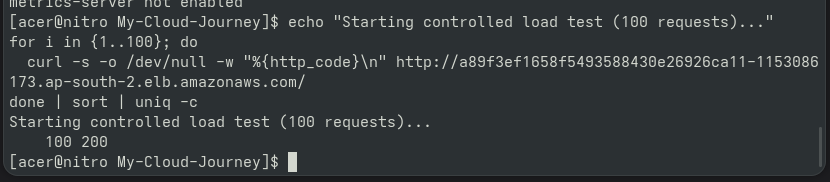
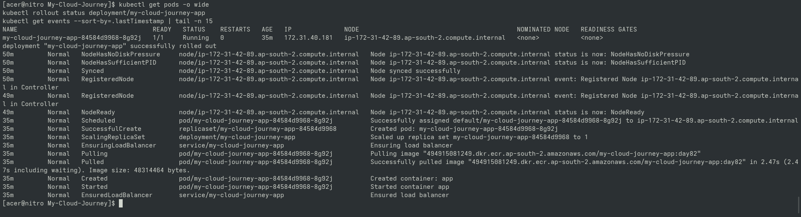
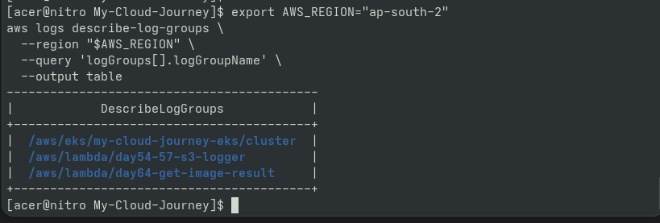

# Day 86 — EKS Load Testing

## Goal

Performed a controlled load test against the EKS-hosted
application and observed the application's behavior through
Kubernetes and AWS monitoring.

## Test

A small controlled request burst was used rather than
high-volume traffic.

## Observed

- Application remained available
- Pod health was monitored
- Kubernetes events were reviewed
- Monitoring data was inspected
- Application behavior under load was documented

## Safety

Load testing was intentionally kept small to avoid
unnecessary AWS resource consumption.

---

## Proof & Verification Artifacts

### 1. Controlled Load Test Execution

### 2. Post-Load Pod & Deployment Health

### 3. CloudWatch Monitoring & Log Verification

