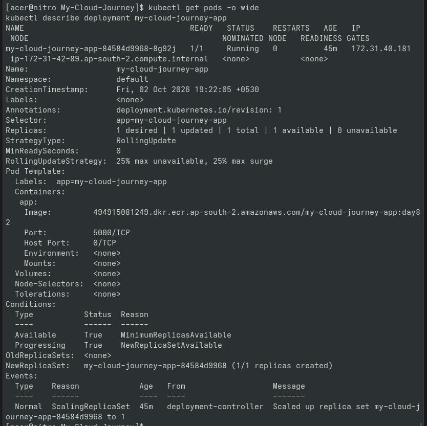
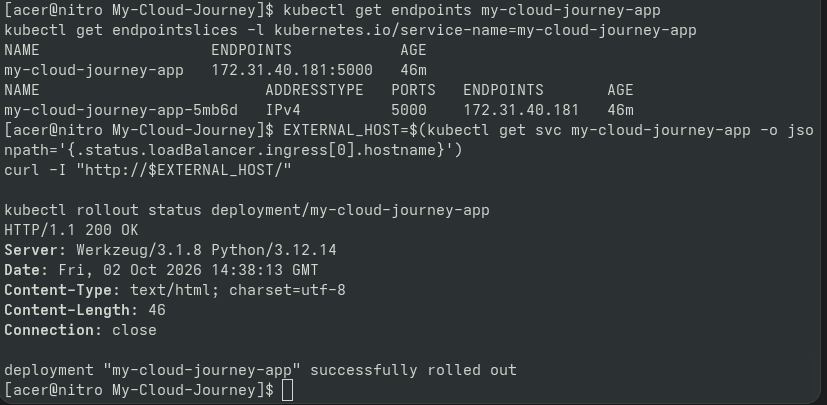
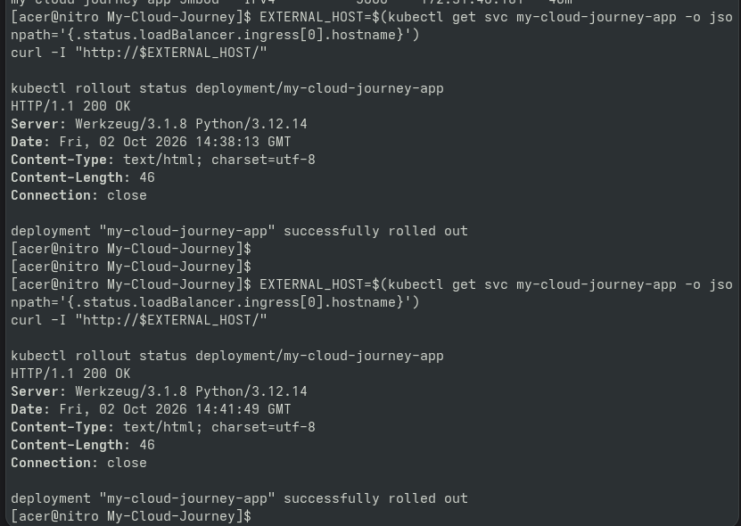

# Day 87 — EKS Reliability Buffer

## Goal

Reviewed and stabilized the EKS application after
Day 86 load testing.

## Verification

- Pod health inspected
- Deployment inspected
- Application logs inspected
- Service endpoints verified
- Kubernetes events reviewed
- Application endpoint retested
- Deployment rollout verified

## Result

The application remained healthy under the controlled
load test.

No unnecessary infrastructure changes were introduced.

## Safety

No additional worker nodes or large AWS services were
created.

---

## Proof & Verification Artifacts

### 1. Pod and Deployment Health Verification

### 2. Application Logs and Endpoint Routing

### 3. Application Retest and Rollout Confirmation

