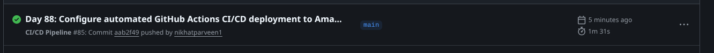
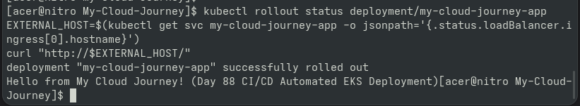
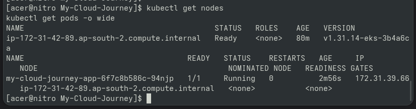

# Day 88 — CI/CD Deployment to EKS

## Goal

Demonstrated automated deployment of the containerized
application to Amazon EKS using GitHub Actions.

## CI/CD Flow

Developer
↓
GitHub
↓
GitHub Actions
↓
Docker Build
↓
Amazon ECR
↓
Amazon EKS
↓
Kubernetes Deployment
↓
Pod
↓
Application
↓
Monitoring

## Verification

- Code change committed
- GitHub push completed
- GitHub Actions workflow executed
- Container image published
- EKS deployment updated
- Pod rollout verified
- Application endpoint tested
- Monitoring dashboard reviewed

## Portfolio Evidence

A screen-recorded demonstration captures the complete
deployment workflow.

---

## Proof & Verification Artifacts

### 1. GitHub Actions Automated Pipeline Success

### 2. EKS Rollout Status and Updated Application Endpoint

### 3. Active Kubernetes Pods & Nodes

