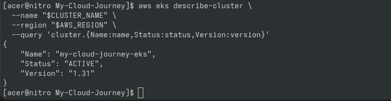
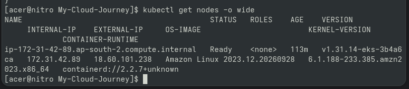
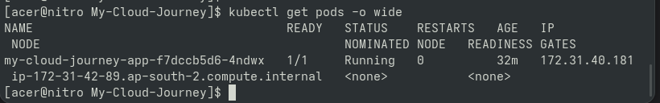
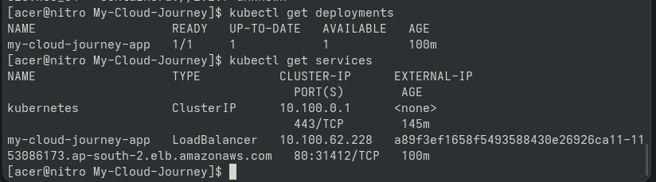
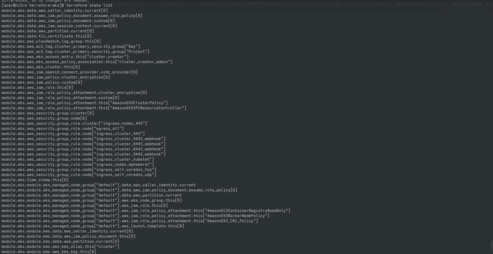

# Day 89 — Project 4 Architecture Documentation

## Overview

Final architecture documentation for the Kubernetes and
CI/CD project was completed after validating the complete
deployment workflow.

## Architecture Flow

Developer
↓
GitHub
↓
GitHub Actions
↓
Container Build
↓
Amazon ECR
↓
Amazon EKS
↓
Kubernetes Deployment
↓
Application Pod
↓
Monitoring / CloudWatch

## Infrastructure

- Amazon EKS
- Kubernetes v1.31
- Single managed worker node
- Worker instance type: t3.small
- AWS Region: ap-south-2
- Terraform-managed infrastructure
- Amazon ECR
- GitHub Actions CI/CD

## Final Verification

- EKS cluster verified ACTIVE
- Worker node verified Ready
- Kubernetes workloads verified
- Application deployment verified
- CI/CD workflow verified
- Monitoring reviewed
- Terraform state reviewed

## Cost Safety

The EKS environment is intentionally retained through
Day 89 so that all Project 4 verification and documentation
can be completed.

The infrastructure is scheduled for controlled Terraform
destruction on Day 90.

## Destruction Plan

Day 90 will perform:

terraform plan
↓
terraform destroy
↓
AWS resource verification
↓
Terraform state verification
↓
GitHub documentation
↓
Final cost-safety verification

---

## Proof & Verification Artifacts

### 1. Amazon EKS Active Cluster Status

### 2. Kubernetes Worker Node Ready

### 3. Application Pod Health

### 4. Deployments and Public LoadBalancer Service

### 5. Terraform State Integrity

