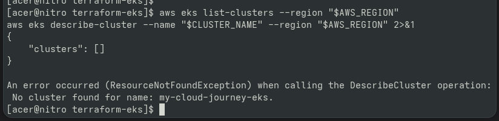
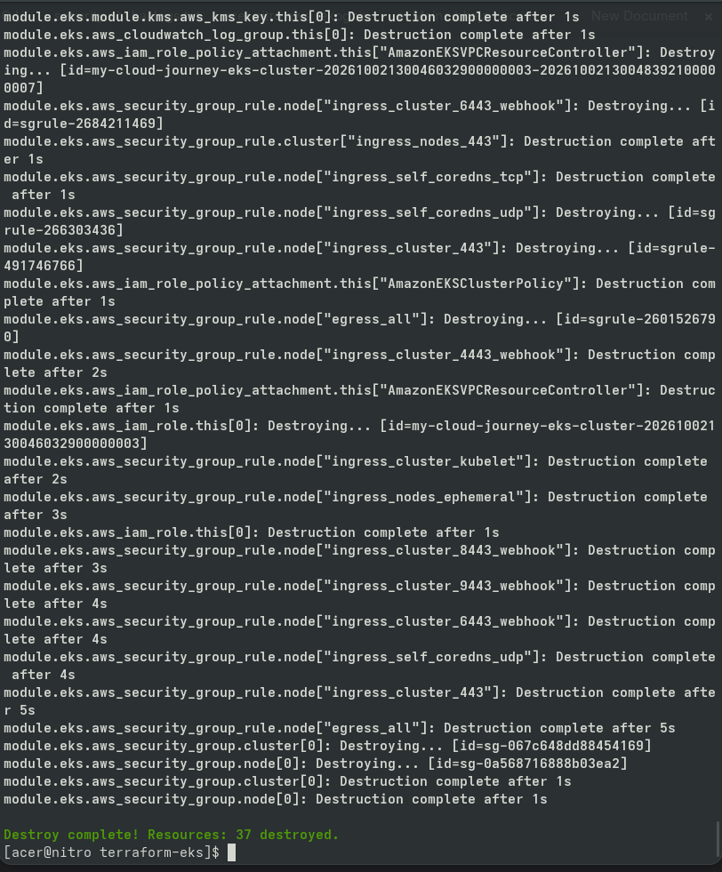
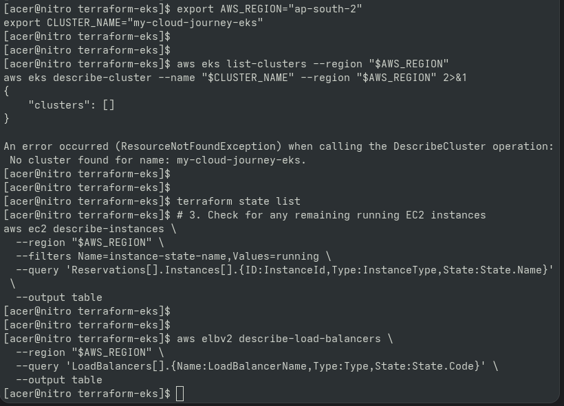

# Day 90 — EKS Infrastructure Destruction & Cost Safety

## Objective

Safely destroyed the Terraform-managed Project 4 EKS
infrastructure after completing all required Kubernetes,
CI/CD, monitoring, load-testing, and architecture work.

## Pre-Destruction Verification

- EKS cluster verified ACTIVE
- Kubernetes worker node verified Ready
- Application workload verified
- Terraform state reviewed
- Terraform plan reviewed
- AWS resources reviewed
- Project documentation pushed to GitHub

## Destruction

Infrastructure was removed using:

terraform destroy

The destruction was performed only after verifying that
the Terraform directory contained the intended Project 4
infrastructure.

## Post-Destruction Verification

- EKS cluster no longer exists
- EKS node group no longer exists
- Terraform state verified
- Running EC2 resources reviewed
- Load balancers reviewed
- Remaining AWS resources reviewed for unnecessary cost

## Cost Safety

The EKS cluster was intentionally kept alive through
Days 86–89 because those days required the live cluster
for load testing, reliability validation, CI/CD deployment,
and final architecture documentation.

The cluster was destroyed on Day 90 to prevent ongoing
EKS and worker-node charges.

## Project 4 Status

PROJECT 4 COMPLETE

The infrastructure lifecycle is now:

Create
↓
Deploy
↓
Test
↓
Monitor
↓
Document
↓
Destroy
↓
Verify

---

## Proof & Verification Artifacts

### 1. Pre-Destruction EKS Active Status

### 2. Terraform Destruction Completion

### 3. Post-Destruction AWS Resource Audit

